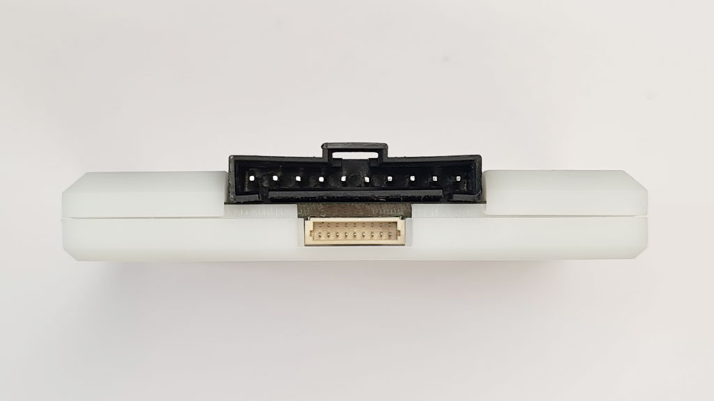
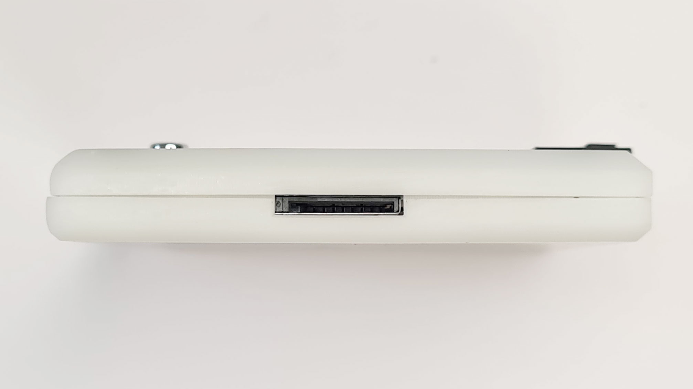
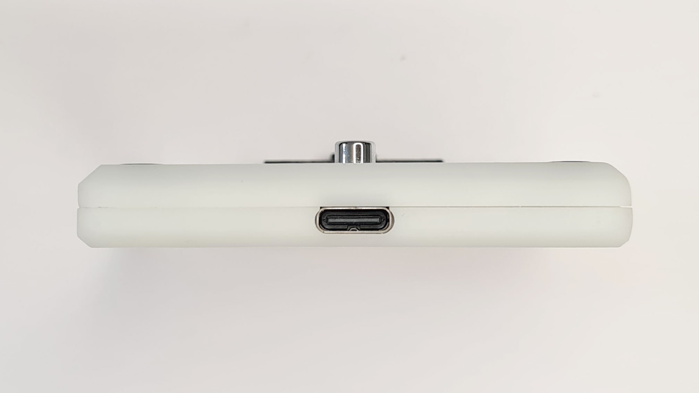
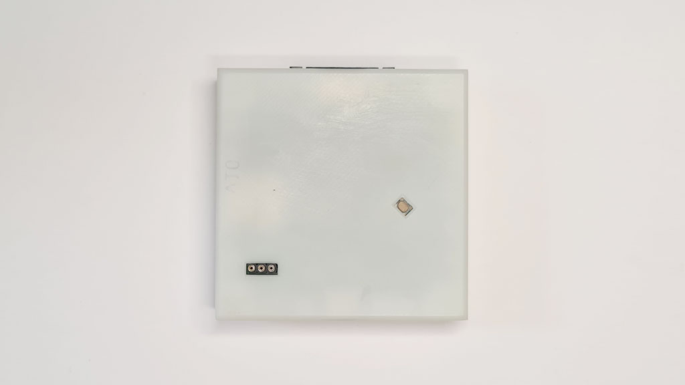

# Bus Pirate 5


Bus Pirate 5 is the universal serial interface tool designed by hackers, for hackers. It's crammed full of hardware and firmware features that make probing chips pleasant and easy.

- LCD - A beautiful 240x320 pixel color IPS (all angle viewing) LCD acts as a pin label, while also showing the voltage on each pin and the current consumption of the programmable power supply unit. 
- 16 RGB LEDs - It's customary to have an indicator LED, so to check that box we added 16 SK6812 RGB LEDs.
- Just one button - 16 party LEDs but just one button!

:::info
This is a general overview of Bus Pirate 5. See the [hardware manual](https://hardware.buspirate.com/) for technical details.
:::


## Main connector


- 2.54mm 10 pin connector - A keyed locking connector that works just as well with common jumper wires and 2.54mm 'DuPont' style connectors.


|Pin|Label|Description|
|-|-|-|
|1|VOUT/VREF|Pin supplies 1-5volts up to 400mA with current limit and resetable fuse (VOUT) **OR** connects an external voltage source to the Bus Pirate IO interface|
|2-9|IO0 - IO7|Buffered IO pins with voltage measurement and optional 10K pull-up resistors|
|10|GND| Ground pin|

## Auxiliary connector


- 1mm 9 pin connector - Intended as a tap point for a logic analyzer. No more trying to balance two or three probes on a single pin, just tap the bus activity from this secondary header.

|Pin|Label|Description|
|-|-|-|
|1-8|IO0 - IO7|Buffered IO pins with voltage measurement and optional 10K pull-up resistors|
|9|GND| Ground pin|

## microSD Card Socket



- microSD card socket - When plugged into a PC USB port, the SD card appears as a readable and writable disk drive. 


- SD card storage is used to save global and mode configuration preferences in simple JSON files. 

## USB C connector


- Modern USB C connector. Only RP2040 supported USB modes are available.

## Bootloader button



- Normally you just hit the ```$``` key in the Bus Pirate terminal to enter bootloader mode for firmware upgrades. You can also use the button on the bottom to activate the bootloader manually.

## JTAG debug header


- A three pin debugging port is exposed on the bottom of the board. See the development section for more info on developing for the Bus Pirate.

|Pin|Label|Description|
|-|-|-|
|1|GND|Ground connection (furthest from the edge of the PCB/case)|
|2|SWDIO|JTAG Data IO|
|3|SWCLK|JTAG Clock (closest to the edge of the PCB/case)|

## VT100 


- VT100 terminal emulation supports color and a live statusbar view of the voltage and functions on each pin.

## Join the fun
### Get Bus Pirate 5
- [Bus Pirate 5 assembled PCB preview release](http://dirtypcbs.com/store/designer/details/ian/6618/bus-pirate-5-developers-version-rev8-no-enclosure)
- Bus Pirate Premium Probe Cable (coming soon!)
- Bus Pirate Premium Auxiliary Cables (coming soon!)
- Bus Pirate 5 and enclosure (coming soon!)

### Community
- [Forum](https://forum.buspirate.com)
- [Blog](https://buspirate.com/) and mailing list
- Mastodon
- [Twitter](https://twitter.com/dangerousproto)

